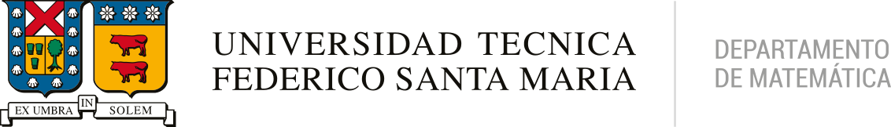

# Talleres: Olimpiadas de Matemáticas USM 2024

Este espacio ha sido creado para motivar a los estudiantes a aprender tanto Python como conceptos matemáticos fundamentales. Aquí encontrarás una variedad de ejemplos prácticos y autocontenidos que te ayudarán a comprender y practicar los principios básicos de la programación en Python, así como a explorar aplicaciones matemáticas de manera sencilla y efectiva.

## Sobre la Iniciativa

Este repositorio forma parte del apoyo a las **Olimpiadas de Matemática Federico Santa María 2024**, una competencia y actividad de divulgación matemática dirigida a todos los estudiantes de Tercero y Cuarto Año de Enseñanza Media de la región de Valparaíso. Nuestro objetivo es inspirar a los estudiantes a adentrarse en el fascinante mundo de la programación y las matemáticas, fomentando un aprendizaje práctico y atractivo.

## Contenidos del Repositorio

- **Ejemplos de Python**: Códigos autocontenidos que cubren desde conceptos básicos hasta aplicaciones más avanzadas.
- **Problemas Matemáticos**: Ejercicios diseñados para reforzar conceptos matemáticos fundamentales a través de la programación.
- **Actividades Interactivas**: Recursos y actividades que combinan Python y matemáticas para un aprendizaje dinámico y práctico.